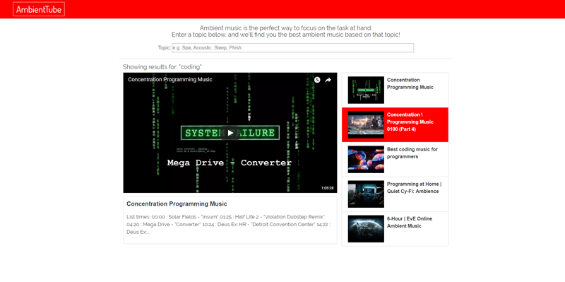

# AmbientTube
HTML / CSS / Bootstrap 4 / JavaScript / React / NPM / YouTube Search API / Lodash / Responsive Design



This React app offers an easy way to find peaceful, non-intrusive ambient music.  
The app has two Class components (index and SearchBar), which handle getting data 
from the YouTube search API (via the youtube-api-search npm package), setting the state
and passing the props down to the functional components which display the video search result data. The SearchBar component automatically updates the search as the user types, 
so I used the .debounce Lodash method to delay the API request until the user stops typing.

## Getting Started

To use the app locally, follow these steps in GitBash/Terminal:

```
> git clone https://github.com/D-Molloy/react-youtube.git
> cd react-youtube
> npm install
> npm start
> If the app doesn't open automatically, visit http://localhost:8080/webpack-dev-server/
```